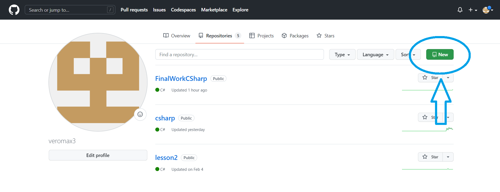
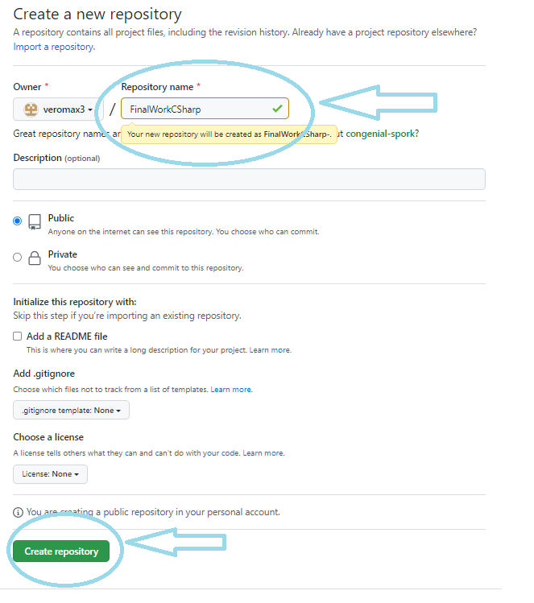
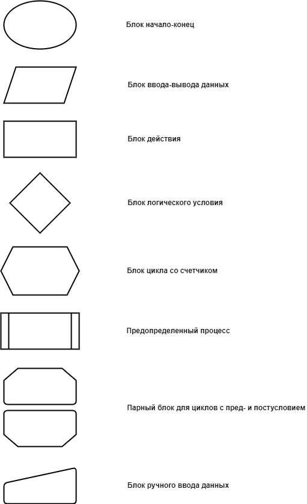
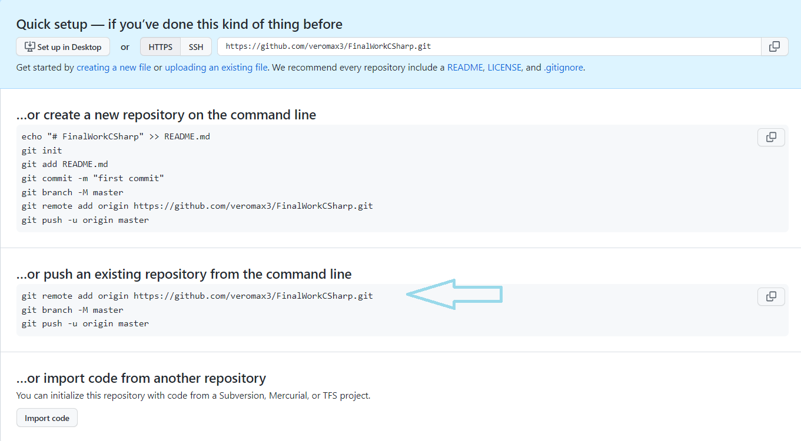

# ИТОГОВАЯ ПРОВЕРОЧНАЯ РАБОТА ПО ПЕРВОМУ БЛОКУ ОБУЧЕНИЯ ПО ПРОГРАММЕ РАЗРАБОТЧИК # 

## __Целью__ данной работы является написание программы, которая из имеющегося массива строк формирует массив из строк, длина которых меньше или равна 3, а также перенос результатов в оформленном виде в удаленный репозиторий на GitHub. ## 

Для достижения данной цели были поставлены следующие __задачи:__  

1. Создать удаленный репозиторий на GitHub
2. Создать блок-схему алгоритма 
3. Снабдить репозиторий оформленным текстовым описанием решения (README.md) 
4. Написать программу 
5. Использовать контроль версий с условием сохранения разных частей проекта в отдельных коммитах  

>> ## *Создание удаленного репозитория* ## 

В своем профиле на GitHub создаем новый репозиторий

  

 

>> ## *Создание блок-схемы алгоритма* ##  

На сайте https://app.diagrams.net/  создаем блок-схему алгоритма  программы. 

>> ## *Снабжение репозитория оформленным текстовым описанием решения (README.md)* ## 
Прописываем название работы, ее цель, задачи, решение. Для оформления используем язык разметки Markdown.

>> ## *Написание программы* ##  
Цель программы - сформировать из уже существующего массива строк новый массив из строк, длина которых меньше 3 символов или равна 3.
Для достижения данной цели решаем следующие задачи:  
* Сформировать исходный массив строк, запрашивая его элементы у пользователя.
* Найти в данном массиве элементы с длиной в 3 или менее символа.
* Сформировать дочерний массив размером, эквивалентным количеству найденных в предыдущей задаче элементов.
* Еще раз запустить поиск необходимых элементов в исходном массиве с последующим их записыванием в дочерний массив.  

>> ## *Использование контроля версий с условием сохранения разных частей проекта в отдельных коммитах* ##

После создания каждой новой части работы используем команду *git add __имя файла__* и *git commit -m __"имя сохранения"__* (либо для массовой фиксации изменений *git add ..* ).  
Чтобы наполнить удаленный репозиторий информацией из локального репозитория используем команду *git push*. Однако перед этим необходимо связать между собой репозитории.  
После создания удаленного репозитория на GitHub выпадает окно, в котором предложены построчные варианты действий. Пользуемся вторым решением в 3 строки (push an existing repository from the command line). 

  

 
 